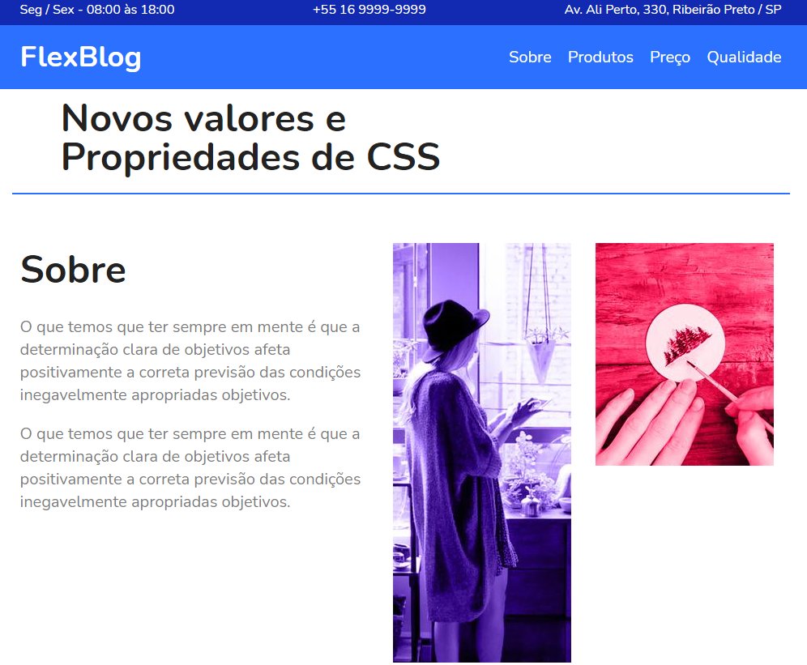
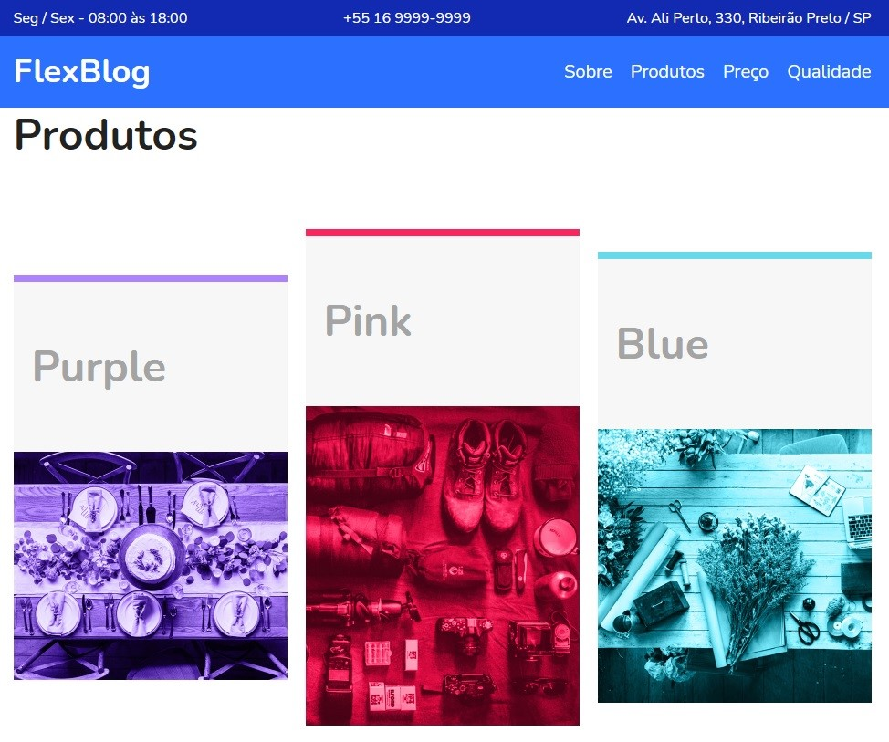
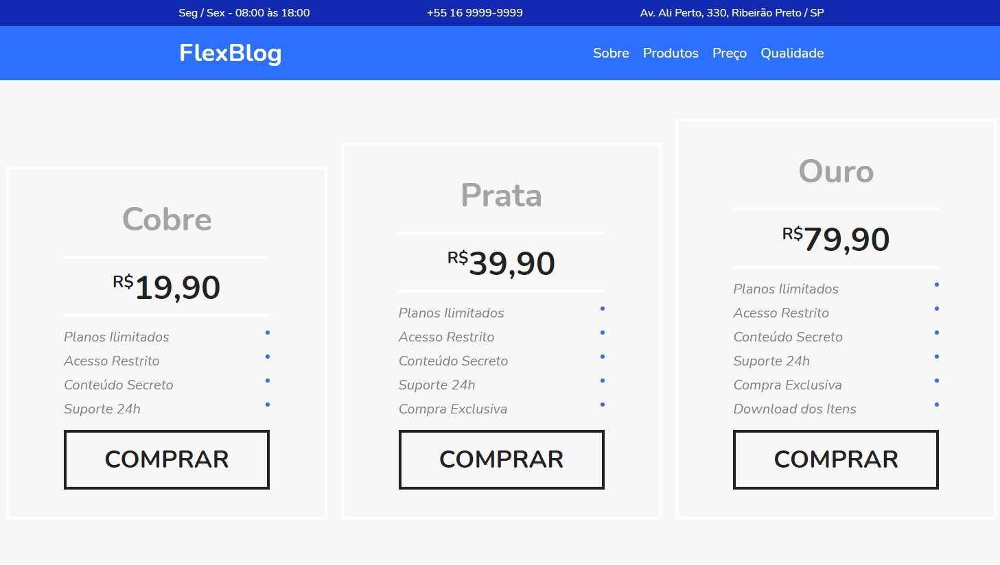
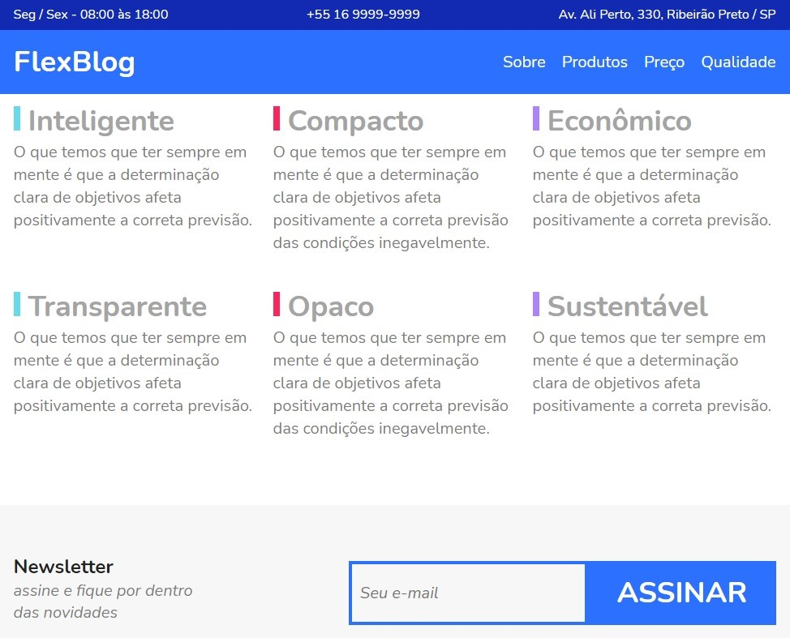
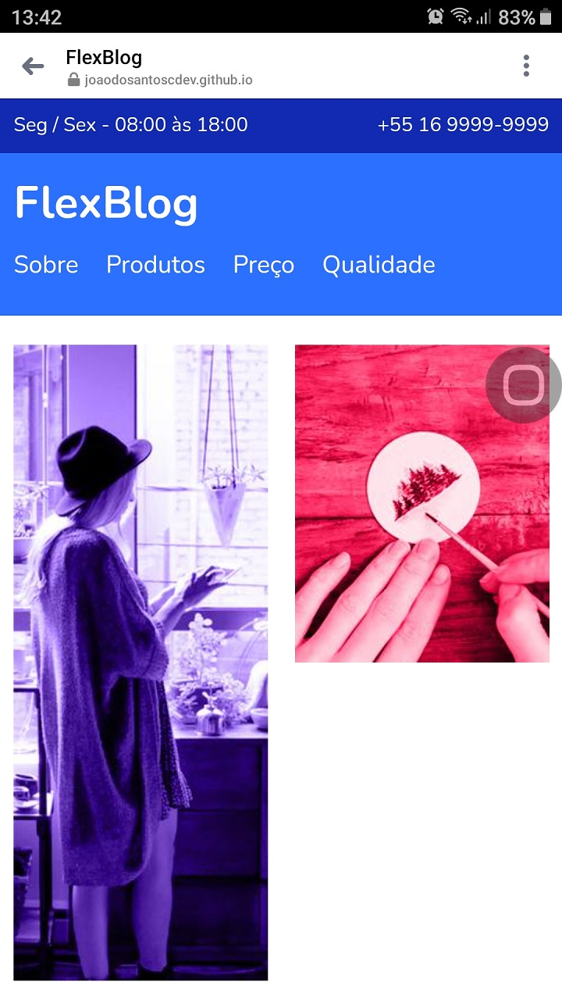
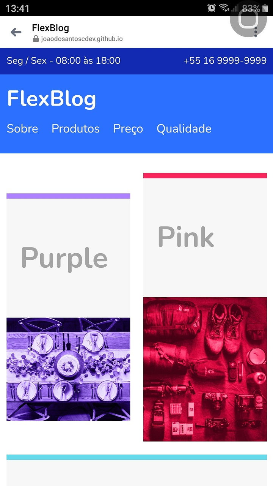
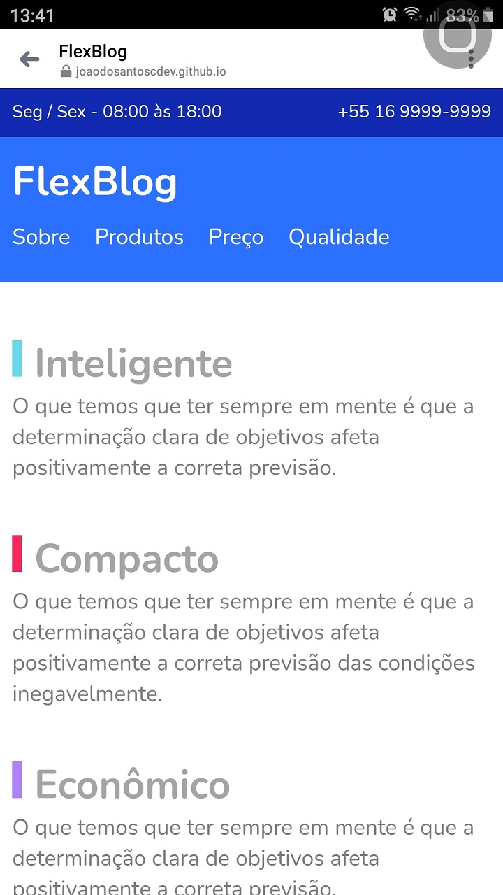
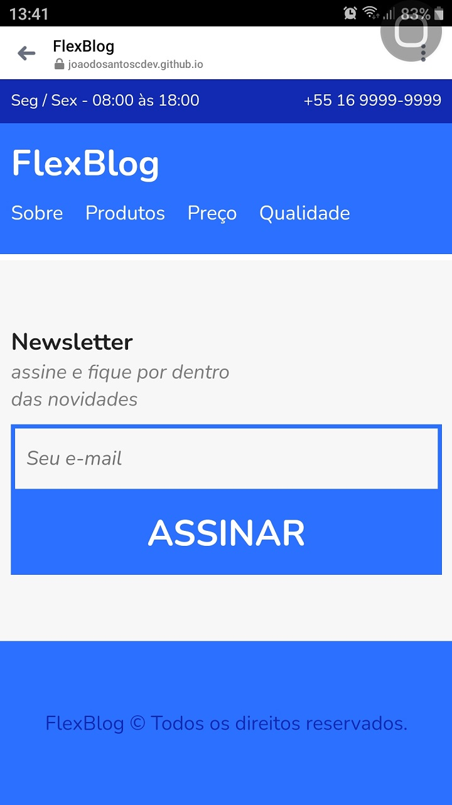

<h2>Project focused in HTML5 & CSS Flexbox 🛠️ </h2>

<h3>➡️Developed during Origamid CSS Flexbox classes.</h3>

You can acess <a href="https://joaodosantoscdev.github.io/flexblog/flexblog" target="_blank" alt="flexblog">here</a>.

<h3>Desktop 🖥️</h3>
</img>
 
</img>
 
</img>
 
</img>

<h3>Mobile 📱</h3>
</img>
 
</img>
 
</img>
 
</img>
 
</img>
 
</img>

<h3>Overview ⮯</h3>

Developed with the purpose to apply my knowledges in CSS Flexbox, to create more responsive and enjoyable experience for the final user.   📱 💻 🖥️

It's a one-page static website, with all the content being tottaly styleshed in CSS Flexbox.The main objective on this was to use all the properties available at this resource, alligned with a design concept, to apply and absorve praticly all the content during the lessons. 🧑‍💻

 
<em>'Non-profit project, only for the application of my studies..' 📚</em>

<strong>---João Vítor Carvalho 👨‍💻 ---</strong>
