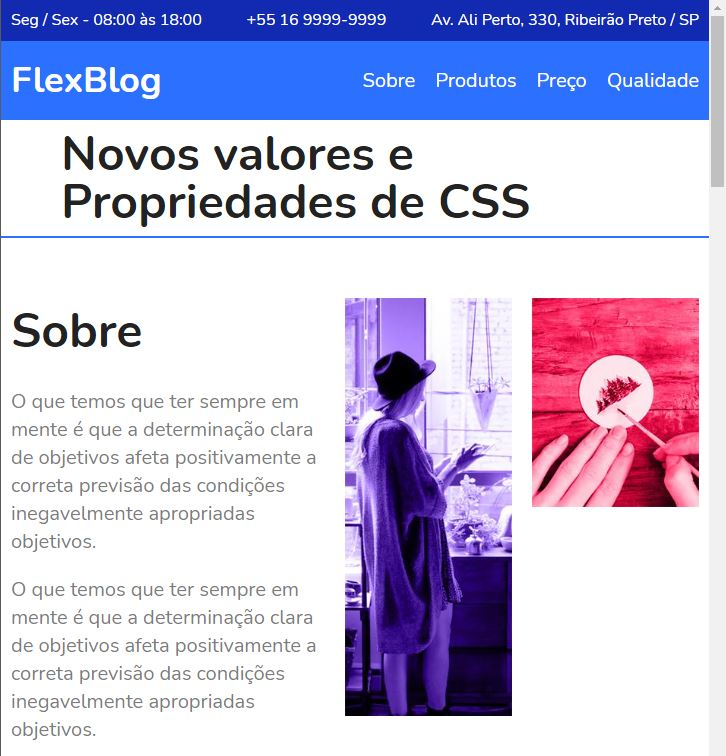

<h2>Projeto focado no estudo de  HTML5 e CSS Flexbox 🛠️ </h2>

<h3>➡️Construido durante a realização do curso de CSS Flexbox da Origamid.</h3>

</img>

Construído afim de facilitar a navegação de usuários em quaisquer plataformas, visando a responsívidade 📱 💻 🖥️

 
<em>'Projeto sem fins lucrativos, somente para aplicação de estudos.' 📚</em>

<strong>---João Vítor Carvalho---</strong>
